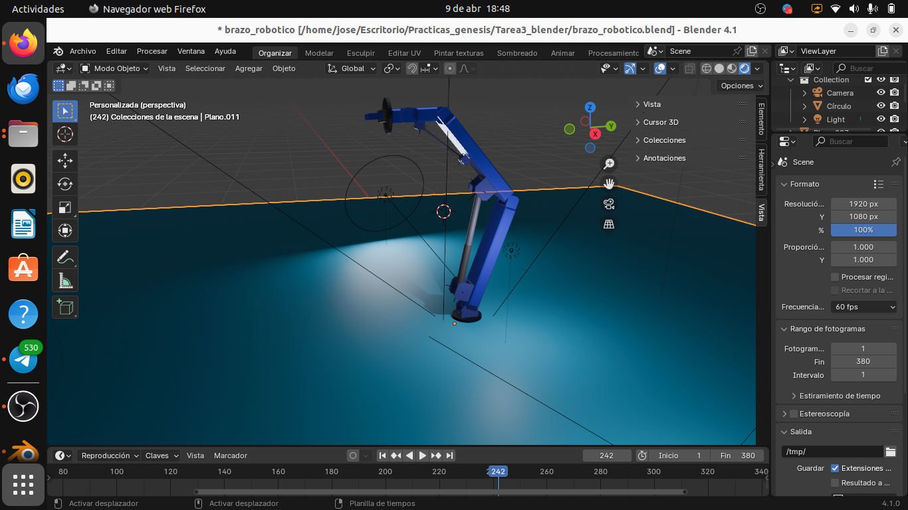

# Brazo Robótico en Blender

Este proyecto consiste en un modelo 3D de un brazo robótico creado en Blender. El brazo está diseñado con articulaciones móviles y es totalmente animable, lo que permite simular diversos movimientos y funciones típicas de un robot industrial. El modelo está optimizado para ser usado tanto en proyectos de animación como en simulaciones de robótica.

## Características:
- Modelo 3D completamente detallado y riggeado.
- Animaciones para movimientos básicos del brazo (rotación, extensión, agarre, etc.).
- Escena de Blender lista para ser usada y modificada.
- Compatible con versiones recientes de Blender.
- Documentación básica para su uso y personalización.

  

Puedes ver una demostración del brazo robótico en el siguiente video:

[Brazo Robot con Blender](https://www.youtube.com/watch?v=qQDVk76BhPg)
